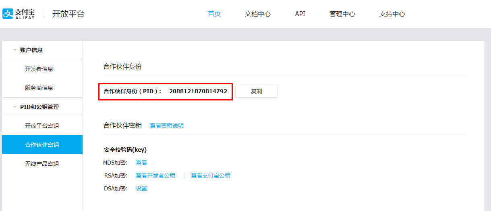

# AliPay Module #
支付宝支付集成的 Library

## 使用步骤 ##

[支付宝开放平台](https://openhome.alipay.com/platform/home.htm)

1. 注册支付宝开发者账号，需申请移动支付功能
2. 生成公钥和私钥
	- [支付宝快捷支付集成及ALI64错误的有效解决](http://www.lxway.com/509081056.htm)
	- [接入支付宝出现交易订单处理失败，请稍后再试（ALI64）的错误](http://www.01happy.com/alipay_error_ali64/)
	- 最好将可以传公钥的地方都可以传一下，其中 "合作伙伴密钥" 为移动支付等作用
3.  在module的AliPayConfig类中进行配置
4.  即可使用

## 其他 ##
###公钥和私钥生成
在下载的Demo中的openssl文件夹中，依照 "生成命令.txt" 步骤生成即可  
[支付宝支付Demo下载地址](http://aopsdkdownload.cn-hangzhou.alipay-pub.aliyun-inc.com/demo/WS_MOBILE_PAY_SDK_BASE.zip?spm=a219a.7629140.0.0.v4JXul&file=WS_MOBILE_PAY_SDK_BASE.zip)

###PID位置

 